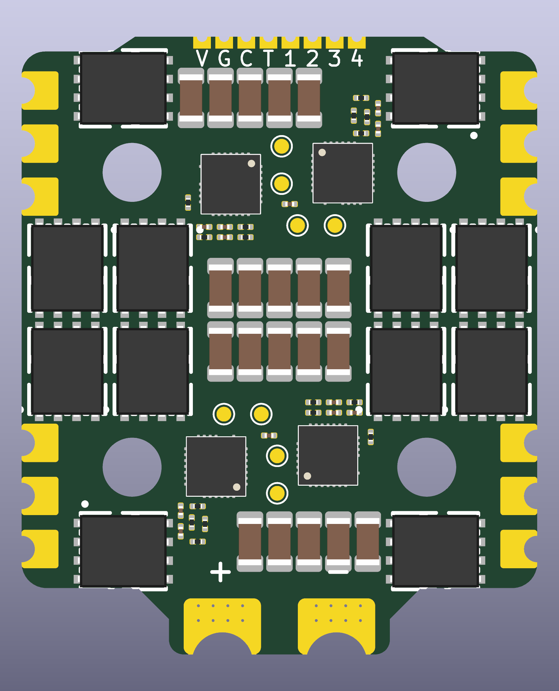
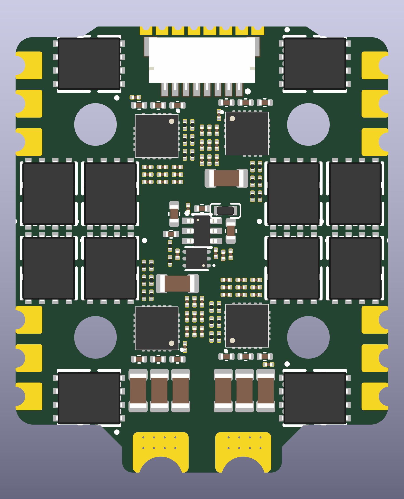

# OpenESC-20x20

A 4-in-1 sensorless BLDC ESC for the **20 x 20 mm** FPV stack hole pattern: four
independent motor controllers, each with its own MCU, gate driver and six
MOSFETs, running AM32 and taking DShot over a standard 8-pin connector.

> **Status: placement only.** All parts are placed, but there is **no copper and
> no routing**. The board has not been routed, fabricated or tested. Do not
> order it. See [Known issues](#known-issues).

<p>


</p>

3D views: [top](hardware-20x20/images/20x20-3d-top.png),
[bottom](hardware-20x20/images/20x20-3d-bottom.png).

This is a new PCB layout of the circuit from
[OpenDrone-hw/OpenESC-30x30](https://github.com/OpenDrone-hw/OpenESC-30x30)
(CERN-OHL-S-2.0, maintainer [@Just4Stan](https://github.com/Just4Stan)). The
schematic file is unchanged, but this board **does not include the current-sense
circuit** (see below); the outline and layout are new. It is not an official OpenDrone or Incutec release and is not covered by the
upstream OSHWA certification.

## What changed from the 30x30

| | 30x30 (upstream) | 20x20 (this layout) |
|---|---|---|
| Mounting holes | 30.5 mm pattern | 20 x 20 mm, 4 mm unplated, no copper ring |
| Board size | 30.5 mm class | about 35 x 42 mm including battery tab |
| Layers / copper | 6 layers, 1.6 mm, 2 oz outer / 1 oz inner | same (rules in `4in1.kicad_pro` and `4in1.kicad_dru`) |
| Motor pads | per upstream | corner groups, 3 pads per motor, no notch mid-edge |
| MOSFETs | 24 | 24, as 12 stacked pairs (high side top, low side bottom) |
| Bulk ceramic 1206 | 52 | **28**, on top near the MOSFETs |
| Battery pads | per upstream | two castellated pads on a tab, 4 mm wide x 1.5 mm deep |
| MCU, drivers, critical passives | per upstream | bottom side |
| Programming pads | per upstream | 2.54 mm pitch with hand-rework clearance |
| Current sense | INA186 + 2 shunts, board level | **not on this board** |

Fewer bulk capacitors means less local ripple filtering; install the 470 uF 50 V
electrolytic on the battery leads. Current capacity of this layout is **not**
validated; four channels at 60 A through a board this size is not realistic. See
[hardware-20x20/docs/DESIGN-NOTES.md](hardware-20x20/docs/DESIGN-NOTES.md).

## Specifications (circuit, as upstream)

| | |
|---|---|
| Firmware | AM32 |
| ESC protocol | DShot, bidirectional |
| Telemetry | Extended DShot |
| Input | 2-8S LiPo (6.0-33.6 V) |
| BEC | None |
| Rated current | 60 A / channel in the 30x30 design; **not established for this layout** |

## Architecture

Four independent channels share one power input and one connector. Per channel:
an **AT32F421G8U7** (Cortex-M4, QFN-28) drives an **NSG2065Q** three-phase
half-bridge gate driver, which drives six **SP40N01GHNK** MOSFETs, two per
phase. One channel is drawn once in `ESC.kicad_sch` and instantiated four times.

**There is no current sensing on this board.** The upstream design has a board-level
INA186A3IDCKR across two 0.2 mOhm shunts, reported as `/CURR`. That circuit is
not placed here: U12, Rsense1, Rsense2, R89, R90, C40, C41, C42, C94 and R73 are
in the schematic but not on the PCB, and no per-phase shunts were added either.
`/CURR` (connector pin 3) is therefore not driven. See
[Known issues](#known-issues).

## Power

```
Battery + (2S-8S) ─► +BATT
+BATT ─┬─► MOSFET drains, motor phases
       └─► LMR54406DBVR buck ─► +10V ─┬─► 4x gate driver
                                      └─► TLV76733DRVR ─► +3V3 ─► 4x MCU
```

## Key parts

| Function | Ref | Part | LCSC | Note |
|---|---|---|---|---|
| Motor MCU, x4 | U2, U5, U7, U9 | AT32F421G8U7, QFN-28 | C2765098 | One per channel |
| Gate driver, x4 | U4, U6, U8, U10 | NSG2065Q, QFN-24 | C41414478 | Standard footprint, alternatives exist |
| Power MOSFET, x24 | Q1-Q24 | SP40N01GHNK, PDFN-8L 5x6 | C22385416 | 40 V, 6 per channel; standard 5x6 DFN footprint |
| Buck | U13 | LMR54406DBVR, SOT-23-6 | C5219316 | 1.1 MHz, 0.6 A; FB 115k/10k against 0.8 V for 10.0 V out |
| Buck inductor | U14 | FTC160808S4R7MBCA | C46594347 | 4.7 uH |
| LDO | U15 | TLV76733DRVR, WSON-6 | C2848334 | +10 V to +3V3 |
| Connector | J1 | SM08B-SRSS-TB, JST SH 8-pin | C160407 | Also broken out as castellated pads |
| Bulk electrolytic | / | 470 uF 50 V | / | Installed by the user on the battery leads |
| Bulk ceramic | see PCB | 4.7 uF 1206, X5R 50 V | C380366 | 28 fitted on this layout |

## Connectors and I/O

Betaflight standard 8-pin:

| Pin | Net | Function |
|---|---|---|
| 1 | +BATT | Battery positive |
| 2 | GND | Ground |
| 3 | /CURR | Current sense output; **not driven on this board** (no INA186 fitted) |
| 4 | unconnected | See below |
| 5 | /M1 | DShot, channel 1 |
| 6 | /M2 | DShot, channel 2 |
| 7 | /M3 | DShot, channel 3 |
| 8 | /M4 | DShot, channel 4 |

Pin 4 is the dedicated telemetry pin in the Betaflight 8-pin standard and is
intentionally left unconnected: ESC to FC telemetry rides the motor signal lines
over bidirectional extended DShot instead.

## Layout rules

Bulk decoupling on +BATT and GND exists on the PCB without matching schematic
symbols. That is a deliberate board-only bank. Do not run update-from-schematic
without checking what it would delete.

## Firmware

[AM32](https://github.com/am32-firmware/AM32). Load the bootloader
(`AM32_F421_BOOTLOADER_PB4_V19.hex`) first with an ST-LINK, then flash and
configure the firmware in-browser at [am32.ca](https://am32.ca). Works with
Betaflight and any other DShot-capable flight controller.

## Repository

| | |
|---|---|
| Designed in | KiCad 10 |
| KiCad project | `hardware-20x20/4in1.kicad_pro` (name kept from upstream) |
| Schematics | `hardware-20x20/4in1.kicad_sch` (power, connector; still contains the upstream current-sense circuit that this board omits) plus `ESC.kicad_sch` (one channel, instantiated 4x) |
| Board | `hardware-20x20/4in1.kicad_pcb`, 6 layers, 1.6 mm, 2 oz outer / 1 oz inner copper |
| Board setup | 0.09 mm clearance and track, 0.16 mm on outer layers (2 oz), via 0.35 on 0.20 drill |
| Design rules | `hardware-20x20/4in1.kicad_dru` |
| Local libraries | `components.kicad_sym`, `4in1ESC-30x30.pretty/`, `4in1ESC-30x30.3dshapes/` (only the models in use), inherited from upstream |
| Fab config | `hardware-20x20/fabrication-toolkit-options.json` |
| Renders | `hardware-20x20/images/` |
| Design notes | `hardware-20x20/docs/DESIGN-NOTES.md` |
| Last DRC | `hardware-20x20/docs/drc-v15-placement.json` |
| Placement scripts | `hardware-20x20/tools/` (provenance only, see its README) |
| License | CERN-OHL-S-2.0, see [LICENSE](LICENSE) |

## Checks

```sh
kicad-cli sch erc hardware-20x20/4in1.kicad_sch
kicad-cli pcb drc --schematic-parity --refill-zones hardware-20x20/4in1.kicad_pcb
```

Last DRC run (`docs/drc-v15-placement.json`): no clearance errors; 20
`annular_width` findings (the castellated battery and motor pad half-holes,
expected for castellation); 29 `lib_footprint_mismatch` (to be cleared by
re-saving footprints from KiCad against the local library); 472 unconnected
items because nothing is routed. DRC was run without schematic parity. ERC was
not re-run; the schematic file is unchanged from upstream.

KiCad files cannot be merged. Close KiCad before any scripted write to a KiCad
file, and do not text-edit `.kicad_sch`, `.kicad_pcb` or `.kicad_dru`.

## Known issues

- **Schematic and board disagree.** The schematic still has the current-sense
  circuit (U12, Rsense1/2, R89, R90, C40-C42, C94, R73), which is not on the PCB.
  A DRC with schematic parity will report these as missing footprints.
  Either update the schematic in KiCad to match, or place the circuit.
- No copper, planes, vias or tracks. Routing, power-plane design and a current
  and thermal check are all still to do.
- The 20 castellation `annular_width` findings need the fab to accept
  half-plated holes of this size.
- Some small parts sit in tight clusters (0.2 to 0.3 mm gaps). An earlier
  routing attempt on a related layout failed mostly on boxed-in pads, so expect
  to spread parts or route by hand.
- Silkscreen text may still carry upstream naming; review before any fab export.

## Revisions

| Rev | Date | Change |
|---|---|---|
| v15 | 2026-10-08 | Placement only: 28 bulk caps with fab-safe spacing, battery castellation pads run to the edge, J2 silk labels 1.0 mm. No copper. |

Upstream revision history (30x30 Rev1 to Rev3.3) is in the
[OpenESC-30x30 repository](https://github.com/OpenDrone-hw/OpenESC-30x30).

## Credit and licence

CERN-OHL-S-2.0, same as upstream. Original circuit and 30x30 design by the
OpenDrone / Incutec team, maintainer @Just4Stan. The 20x20 board layout is a
modified version; changes are limited to PCB outline and placement as described
above. Upstream branding, badges and certification do not carry over to this
layout.
